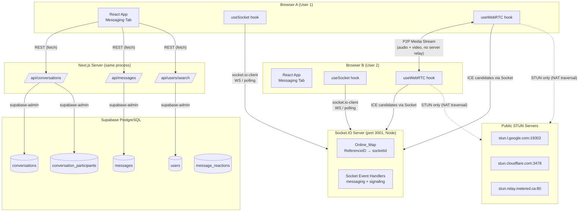

# Design Document — Biolog Messaging + WebRTC Video Call

## Overview

The Biolog Messaging + WebRTC module adds a dedicated **Messaging** tab to the existing Acculog attendance system. It delivers real-time direct and group messaging backed by the existing Supabase PostgreSQL tables, with peer-to-peer WebRTC video calls that work across different networks without routing media through any server.

The system uses a two-layer real-time architecture:

1. **Persistence layer** — Next.js App Router API routes read/write the `conversations`, `conversation_participants`, `messages`, and `message_reactions` Supabase tables. No schema changes are required; a Supabase database trigger (`trg_new_message_updates_conv`) already keeps `conversations.last_message_at` in sync on message insert.

2. **Real-time layer** — A standalone Socket.IO server (Node, port 3001) acts as an event broker. It maintains an in-memory `Online_Map` (`Map<ReferenceID, socketId>`) and routes messaging events, typing indicators, read receipts, and WebRTC signaling messages. It never relays media.

3. **Media layer** — WebRTC peer connections are established directly between browsers using public STUN servers (Google + Cloudflare + public) for NAT traversal. Once the ICE negotiation completes, audio/video streams flow peer-to-peer with zero server involvement.

The module is built entirely within the existing Next.js 14+ App Router project. No new databases, cloud services, or paid relay servers are required.

---

## Architecture

### System Architecture Diagram



### WebRTC Signaling Sequence

```mermaid
sequenceDiagram
    participant Caller
    participant Server as Socket.IO Server
    participant Callee

    Caller->>Server: initiate_call { callerId, calleeId, callerName }
    Server->>Callee: call_incoming { callerId, callerName }
    Caller->>Server: webrtc_offer { offer, calleeId }
    Server->>Callee: webrtc_offer { offer, from: callerId }
    Note over Callee: User accepts → handleOffer()
    Callee->>Server: webrtc_answer { answer, callerId }
    Server->>Caller: webrtc_answer { answer }
    Note over Caller,Callee: ICE candidates exchanged in parallel
    Caller-->>Server: webrtc_ice_candidate { candidate, targetId: calleeId }
    Server-->>Callee: webrtc_ice_candidate { candidate }
    Callee-->>Server: webrtc_ice_candidate { candidate, targetId: callerId }
    Server-->>Caller: webrtc_ice_candidate { candidate }
    Note over Caller,Callee: STUN resolves public IP/port mappings
    Note over Caller,Callee: P2P connection established — media flows directly
```



---

## Components and Interfaces

### Complete File Structure

All files to be created (no existing files modified except adding env vars to `.env.local`):

```
lib/
  types.ts                          ← Shared TypeScript interfaces + pure helper functions
  supabase-admin.ts                 ← Service-role Supabase client for API routes only

socket-server.ts                    ← Standalone Socket.IO server (Node, port 3001)

app/
  api/
    conversations/
      route.ts                      ← GET (list) + POST (get-or-create direct)
    messages/
      route.ts                      ← GET (history) + POST (send) + PATCH (mark-read)
    users/
      search/
        route.ts                    ← GET (keyword search)
  messaging/
    page.tsx                        ← Messaging tab page (root layout + socket/WebRTC wiring)

hooks/
  useSocket.ts                      ← Socket.IO client connection lifecycle hook
  useWebRTC.ts                      ← RTCPeerConnection lifecycle hook

components/messaging/
  ConversationList.tsx              ← Sidebar list with search filter
  ConversationItem.tsx              ← Single conversation row (avatar, name, preview, time)
  MessageThread.tsx                 ← Message history + input + typing indicator
  MessageBubble.tsx                 ← Individual message bubble (own vs other)
  TypingIndicator.tsx               ← Animated "..." typing dots
  NewConversationModal.tsx          ← User search + create direct conversation dialog
  VideoCallOverlay.tsx              ← Full-screen call UI (remote + PiP local)
  IncomingCallAlert.tsx             ← Fixed top-right incoming call notification

__tests__/messaging/
  types.test.ts                     ← PBT: getUserFullName + getUserInitials properties
  conversations.api.test.ts         ← Unit + example tests for /api/conversations
  messages.api.test.ts              ← Unit + example + PBT for /api/messages
  users.search.api.test.ts          ← Unit + example + PBT for /api/users/search
  socket.server.test.ts             ← Unit + PBT for socket event handlers + Online_Map
  useSocket.test.ts                 ← renderHook tests for useSocket lifecycle
  useWebRTC.test.ts                 ← renderHook tests for useWebRTC + config smoke tests
```

### Component Interface Contracts

#### `useSocket(userId: string | null)`
```typescript
returns {
  socket: Socket | null;
  isConnected: boolean;
  emit: (event: string, ...args: unknown[]) => void;
}
```

#### `useWebRTC(socket: Socket | null, currentUserRefId: string)`
```typescript
returns {
  localStream: MediaStream | null;
  remoteStream: MediaStream | null;
  isCallActive: boolean;
  isCalling: boolean;
  isReceivingCall: boolean;
  error: string | null;
  startCall: (calleeId: string, callType?: 'video' | 'audio') => Promise<void>;
  handleOffer: (data: { from: string; offer: RTCSessionDescriptionInit }) => Promise<void>;
  handleAnswer: (data: { answer: RTCSessionDescriptionInit }) => Promise<void>;
  handleIceCandidate: (data: { candidate: RTCIceCandidateInit }) => Promise<void>;
  endCall: () => void;
}
```

#### `ConversationList` props
```typescript
interface ConversationListProps {
  conversations: Conversation[];
  selectedId: string | null;
  currentUserId: string;
  onSelect: (conv: Conversation) => void;
  onNewConversation: () => void;
  loading: boolean;
  error: string | null;
  onRetry: () => void;
}
```

#### `MessageThread` props
```typescript
interface MessageThreadProps {
  conversation: Conversation;
  currentUserId: string;
  socket: Socket | null;
  onStartCall: (calleeId: string) => void;
}
```

#### `VideoCallOverlay` props
```typescript
interface VideoCallOverlayProps {
  localStream: MediaStream | null;
  remoteStream: MediaStream | null;
  isCallActive: boolean;
  isCalling: boolean;
  error: string | null;
  onEndCall: () => void;
}
```

#### `IncomingCallAlert` props
```typescript
interface IncomingCallAlertProps {
  callerId: string;
  callerName: string;
  onAccept: () => void;
  onDecline: () => void;
}
```

---

## Data Models

### `lib/types.ts` — Full Source

```typescript
// lib/types.ts
// Shared TypeScript interfaces and pure helper functions for the Biolog Messaging module.
// Safe to import in both client and server code.

export type ReferenceID = string;

export interface User {
  id: number;                         // bigint PK stored as number
  ReferenceID: ReferenceID;
  Firstname?: string;
  Lastname?: string;
  Email?: string;
  userName?: string;
  Role?: string;
  Position?: string;
  Department?: string;
  profilePicture?: string;
  ContactNumber?: string;
  Status?: string;
}

export interface Conversation {
  id: string;                         // UUID
  conversation_type: 'direct' | 'group';
  created_by: ReferenceID;
  last_message_at: string;            // ISO-8601
  created_at: string;                 // ISO-8601
  updated_at: string;                 // ISO-8601
  name?: string;
  description?: string;
  photo_url?: string;
}

export interface ConversationParticipant {
  id: number;
  conversation_id: string;            // UUID
  user_id: ReferenceID;
  role: 'admin' | 'member';
  last_read_message_id?: string;
  last_seen_at?: string;              // ISO-8601
  user?: User;
}

export interface Message {
  id: string;                         // UUID
  conversation_id: string;
  sender_id: ReferenceID;
  message_type: 'text' | 'image' | 'file' | 'link' | 'voice' | 'video' | 'location' | 'system';
  content: string;
  is_edited: boolean;
  is_deleted: boolean;
  created_at: string;                 // ISO-8601
  updated_at: string;                 // ISO-8601
  reply_to_message_id?: string;
  meta?: Record<string, unknown>;
  sender?: User;
  reactions?: MessageReaction[];
}

export interface MessageReaction {
  id: number;
  message_id: string;
  user_id: ReferenceID;
  reaction: string;
  created_at: string;                 // ISO-8601
}

/**
 * Returns the user's full display name.
 * Priority: trimmed "Firstname Lastname" → userName → ReferenceID
 */
export function getUserFullName(user: User): string {
  const first = (user.Firstname ?? '').trim();
  const last = (user.Lastname ?? '').trim();
  const full = [first, last].filter(Boolean).join(' ');
  if (full.length > 0) return full;
  if (user.userName && user.userName.trim().length > 0) return user.userName.trim();
  return user.ReferenceID;
}

/**
 * Returns 1-2 uppercase initials.
 * Priority: first char of Firstname + first char of Lastname → single available initial → first 2 chars of ReferenceID
 */
export function getUserInitials(user: User): string {
  const first = (user.Firstname ?? '').trim();
  const last = (user.Lastname ?? '').trim();
  if (first.length > 0 && last.length > 0) {
    return (first[0] + last[0]).toUpperCase();
  }
  if (first.length > 0) return first[0].toUpperCase();
  if (last.length > 0) return last[0].toUpperCase();
  return user.ReferenceID.slice(0, 2).toUpperCase();
}
```

### `lib/supabase-admin.ts`

```typescript
// lib/supabase-admin.ts
// Service-role Supabase client for server-side API routes ONLY.
// NEVER import this in client components — it uses the secret service role key.
import { createClient } from '@supabase/supabase-js';

export const supabaseAdmin = createClient(
  process.env.NEXT_PUBLIC_SUPABASE_URL!,
  process.env.SUPABASE_SERVICE_ROLE_KEY!
);
```

### Existing Supabase Schema (read-only reference — no migrations required)

| Table | Key columns |
|---|---|
| `users` | `id` bigint PK, `"ReferenceID"` text UNIQUE, `"Firstname"`, `"Lastname"`, `"Email"`, `"userName"`, `"Role"`, `"Position"`, `"Department"`, `"profilePicture"`, `"ContactNumber"`, `"Status"` |
| `conversations` | `id` uuid PK, `conversation_type` ('direct'\|'group'), `name`, `description`, `photo_url`, `created_by` text, `last_message_at` timestamptz, `created_at`, `updated_at` |
| `conversation_participants` | `conversation_id` uuid FK, `user_id` text→ReferenceID, `role` ('admin'\|'member'), `last_read_message_id` uuid, `last_seen_at` timestamptz |
| `messages` | `id` uuid PK, `conversation_id` uuid, `sender_id` text→ReferenceID, `reply_to_message_id` uuid, `message_type` text, `content` text, `meta` jsonb, `is_edited` bool, `is_deleted` bool, `created_at`, `updated_at` |
| `message_reactions` | `id` bigint PK, `message_id` uuid, `user_id` text→ReferenceID, `reaction` text, `created_at` |

**Trigger**: `trg_new_message_updates_conv` — fires AFTER INSERT on `messages`, updates `conversations.last_message_at = NOW()` for the parent conversation. No code change needed.

### Environment Variables

Add to `.env.local`:

```bash
# Already present
NEXT_PUBLIC_SUPABASE_URL=
NEXT_PUBLIC_SUPABASE_ANON_KEY=

# New — server-side only (never expose to client)
SUPABASE_SERVICE_ROLE_KEY=

# New — socket server
NEXT_PUBLIC_SOCKET_URL=http://localhost:3001
SOCKET_PORT=3001
```

---

## API Route Designs

### `GET /api/conversations?referenceId=X`

**Purpose**: Return all conversations the requesting user participates in, enriched with participant data.

**Validation**: `referenceId` must be a non-empty string → HTTP 400 if absent/empty.

**Query logic**:
1. Select `conversation_id` values from `conversation_participants` where `user_id = referenceId`.
2. Join `conversations` on those IDs, ordered by `last_message_at DESC`.
3. For each conversation, fetch all `conversation_participants` rows (with nested `user` join).
4. For `conversation_type = 'direct'`: identify `otherUser` as the participant where `user_id ≠ referenceId`.

**Response**: `200 Conversation[]` (empty array if none found).

**Errors**: `400` missing referenceId · `500` DB failure (generic message, no stack trace).

---

### `POST /api/conversations`

**Body**: `{ user1RefId: string, user2RefId: string }`

**Validation**: Both fields must be non-empty strings → HTTP 400 per field if missing/empty/non-string.

**Idempotency logic**:
1. Fetch all `conversation_id` values where `user_id = user1RefId` (from `conversation_participants`).
2. Fetch all `conversation_id` values where `user_id = user2RefId`.
3. Find the intersection of both sets.
4. Filter for conversations where `conversation_type = 'direct'`.
5. If found → return existing conversation with `200`.
6. If not found → insert new `conversations` row (`conversation_type = 'direct'`, `created_by = user1RefId`) + two `conversation_participants` rows (both with `role = 'member'`) → return new conversation with `201`.

**Errors**: `400` validation · `500` DB failure.

---

### `GET /api/messages?conversationId=X`

**Validation**: `conversationId` must be non-empty → `400`. Conversation must exist in DB → `404`.

**Query**: Select from `messages` where `conversation_id = X AND is_deleted = false` order by `created_at ASC` limit 100. Join `sender` from `users` on `sender_id = "ReferenceID"`.

**Response**: `200 Message[]` with nested `sender`.

**Errors**: `400` · `404` · `500`.

---

### `POST /api/messages`

**Body**: `{ conversationId: string, senderRefId: string, content: string, messageType?: string }`

**Validation**: All three required fields must be non-empty; `content.length ≤ 2000` → `400` if any fail.

**Insert**: `messages` row with `message_type = messageType ?? 'text'`, `is_edited = false`, `is_deleted = false`. Return inserted row with `sender` join.

**Note**: The DB trigger `trg_new_message_updates_conv` updates `conversations.last_message_at` automatically — no explicit update needed.

**Response**: `201 Message` with sender.

**Errors**: `400` · `500`.

---

### `PATCH /api/messages`

**Body**: `{ conversationId: string, referenceId: string }`

**Validation**: Both fields non-empty → `400`.

**Logic**:
1. Find latest message: `SELECT id FROM messages WHERE conversation_id = conversationId ORDER BY created_at DESC LIMIT 1`.
2. Update `conversation_participants SET last_read_message_id = latest.id, last_seen_at = now() WHERE conversation_id = conversationId AND user_id = referenceId`.
3. If update affects 0 rows → `404`.

**Response**: `200` with updated participant row.

**Errors**: `400` · `404` · `500`.

---

### `GET /api/users/search?keyword=X&excludeRefId=Y`

**Validation**: `keyword` must be present, non-empty after trim, ≥ 1 non-whitespace character, ≤ 200 characters → `400` with reason if any fail.

**Query**: `SELECT * FROM users WHERE ("Firstname" ILIKE '%keyword%' OR "Lastname" ILIKE '%keyword%' OR "Email" ILIKE '%keyword%' OR "userName" ILIKE '%keyword%') AND "ReferenceID" != excludeRefId ORDER BY "Lastname" ASC, "Firstname" ASC LIMIT 20`

If `excludeRefId` is absent, omit the `≠` clause.

**Response**: `200 User[]` (max 20).

**Errors**: `400` · `500`.

---

## Socket.IO Server Design

### `socket-server.ts` — Architecture

**Runtime**: Standalone Node.js process. Start with `ts-node socket-server.ts` or compile and run with `node dist/socket-server.js`.

**Online_Map**: `const onlineUsers = new Map<string, string>()` — `ReferenceID → socket.id`.

**Validation helper**:
```typescript
function requireFields(
  data: Record<string, unknown>,
  fields: string[],
  socket: Socket
): boolean {
  for (const field of fields) {
    if (!data[field] || typeof data[field] !== 'string' || (data[field] as string).trim() === '') {
      socket.emit('error', { message: `Field '${field}' is required and must be a non-empty string` });
      return false;
    }
  }
  return true;
}
```

**Event handlers summary**:

| Inbound event | Required fields | Action | Outbound event |
|---|---|---|---|
| `user_connected` | `referenceId` | `onlineUsers.set(referenceId, socket.id)` | — |
| `disconnect` | — | Remove entries where value = `socket.id` | — |
| `private_message` | `conversationId, senderId, receiverId, content` | Forward to `receiverId` socket (silent drop if offline) | `new_message` to receiver |
| `typing` | `conversationId, senderId, receiverId` | Forward to `receiverId` (silent drop) | `user_typing { conversationId, senderId }` |
| `stop_typing` | `conversationId, senderId, receiverId` | Forward to `receiverId` (silent drop) | `user_stop_typing { conversationId, senderId }` |
| `mark_read` | `conversationId, userId, readerId` | Forward to `userId` socket (silent drop) | `message_read { conversationId, readerId }` |
| `initiate_call` | `callerId, calleeId, callerName` | Forward to `calleeId` (silent drop) | `call_incoming { callerId, callerName }` |
| `webrtc_offer` | `offer, calleeId` | Forward to `calleeId` (silent drop) | `webrtc_offer { offer, from: socket.id }` |
| `webrtc_answer` | `answer, callerId` | Forward to `callerId` (silent drop) | `webrtc_answer { answer }` |
| `webrtc_ice_candidate` | `candidate, targetId` | Forward to `targetId` (silent drop) | `webrtc_ice_candidate { candidate }` |
| `end_call` | `targetId` | Forward to `targetId` (silent drop) | `call_ended` |

**Note on `webrtc_offer`**: The `offer` field is an `RTCSessionDescriptionInit` object (not a plain string), so `requireFields` validates only that it is present (non-null), not that it is a non-empty string. Use a separate `requirePresent` check for object fields.

**Synchronous lookup export** (for testability):
```typescript
export function isOnline(referenceId: string): boolean {
  return onlineUsers.has(referenceId);
}
```

---

## Hook Designs

### `hooks/useSocket.ts`

```typescript
"use client";
import { useEffect, useRef, useState, useCallback } from 'react';
import { io, Socket } from 'socket.io-client';

export function useSocket(userId: string | null): {
  socket: Socket | null;
  isConnected: boolean;
  emit: (event: string, ...args: unknown[]) => void;
} {
  const [isConnected, setIsConnected] = useState(false);
  const socketRef = useRef<Socket | null>(null);

  const emit = useCallback((event: string, ...args: unknown[]) => {
    socketRef.current?.emit(event, ...args);
  }, []);

  useEffect(() => {
    if (!userId || userId.trim() === '') return;

    const socketInstance = io(
      process.env.NEXT_PUBLIC_SOCKET_URL ?? 'http://localhost:3001',
      { transports: ['websocket', 'polling'] }
    );

    socketRef.current = socketInstance;

    const onConnect = () => {
      setIsConnected(true);
      socketInstance.emit('user_connected', { referenceId: userId });
    };

    const onDisconnect = () => setIsConnected(false);

    socketInstance.on('connect', onConnect);
    socketInstance.on('disconnect', onDisconnect);

    // Re-register on reconnection to restore Online_Map entry
    socketInstance.io.on('reconnect', () => {
      socketInstance.emit('user_connected', { referenceId: userId });
    });

    return () => {
      socketInstance.off('connect', onConnect);
      socketInstance.off('disconnect', onDisconnect);
      socketInstance.disconnect();
      socketRef.current = null;
    };
  }, [userId]);

  return { socket: socketRef.current, isConnected, emit };
}
```

### `hooks/useWebRTC.ts`

**RTCConfiguration constant** (module-level, frozen):
```typescript
const RTC_CONFIG: RTCConfiguration = Object.freeze({
  iceServers: [
    { urls: 'stun:stun.l.google.com:19302' },
    { urls: 'stun:stun1.l.google.com:19302' },
    { urls: 'stun:stun2.l.google.com:19302' },
    { urls: 'stun:stun3.l.google.com:19302' },
    { urls: 'stun:stun4.l.google.com:19302' },
    { urls: 'stun:stun.relay.metered.ca:80' },
    { urls: 'stun:stun.cloudflare.com:3478' },
    { urls: 'stun:stun.ekiga.net' },
    { urls: 'stun:stun.ideasip.com' },
  ],
  iceCandidatePoolSize: 10,
  rtcpMuxPolicy: 'require' as RTCRtcpMuxPolicy,
  bundlePolicy: 'max-bundle' as RTCBundlePolicy,
});
```

**getUserMedia wrapper with 30-second timeout**:
```typescript
async function getUserMediaWithTimeout(
  constraints: MediaStreamConstraints
): Promise<MediaStream> {
  return Promise.race([
    navigator.mediaDevices.getUserMedia(constraints),
    new Promise<never>((_, reject) =>
      setTimeout(
        () => reject(new Error('Media access timeout after 30 seconds')),
        30_000
      )
    ),
  ]);
}
```

**State and refs**:
```
State: localStream, remoteStream, isCallActive, isCalling, isReceivingCall, error
Refs:  peerConnectionRef (RTCPeerConnection | null)
       localStreamRef    (MediaStream | null)
       remoteIdRef       (string | null)
       callTimeoutRef    (ReturnType<typeof setTimeout> | null)
```

**`startCall(calleeId, callType?)` steps**:
1. Guard: if `calleeId` is empty, return without side effects.
2. `setIsCalling(true)`.
3. `getUserMediaWithTimeout({ video: callType !== 'audio', audio: true })` — on error: `setError(e.message)`, `setIsCalling(false)`, return.
4. `setLocalStream(stream)`, `localStreamRef.current = stream`.
5. `remoteIdRef.current = calleeId`.
6. Create `new RTCPeerConnection(RTC_CONFIG)`, assign `peerConnectionRef.current`.
7. Add all tracks from stream.
8. `pc.ontrack = (e) => setRemoteStream(e.streams[0])`.
9. `pc.onicecandidate = (e) => { if (e.candidate) socket?.emit('webrtc_ice_candidate', { candidate: e.candidate, targetId: calleeId }) }`.
10. `createOffer()` → `setLocalDescription(offer)`.
11. `socket?.emit('webrtc_offer', { offer, calleeId })`.
12. `socket?.emit('initiate_call', { callerId: currentUserRefId, calleeId, callerName: currentUserRefId })`.

**`handleOffer({ from, offer })` steps**:
1. `setIsReceivingCall(true)`.
2. Create `RTCPeerConnection(RTC_CONFIG)`, assign `peerConnectionRef.current`.
3. `remoteIdRef.current = from`.
4. Set `ontrack` and `onicecandidate` (targetId = `from`).
5. `getUserMediaWithTimeout(...)` — on error: `setError(e.message)`, `setIsReceivingCall(false)`, return.
6. `setLocalStream(stream)`, `localStreamRef.current = stream`.
7. Add all tracks.
8. `pc.setRemoteDescription(new RTCSessionDescription(offer))`.
9. `createAnswer()` → `setLocalDescription(answer)`.
10. `socket?.emit('webrtc_answer', { answer, callerId: from })`.

**`handleAnswer({ answer })` steps**:
1. `peerConnectionRef.current?.setRemoteDescription(new RTCSessionDescription(answer))`.
2. `setIsCallActive(true)`.

**`handleIceCandidate({ candidate })` steps**:
1. If `!peerConnectionRef.current` → return silently.
2. `peerConnectionRef.current.addIceCandidate(new RTCIceCandidate(candidate))`.

**`endCall()` steps**:
1. `clearTimeout(callTimeoutRef.current!)`.
2. `localStreamRef.current?.getTracks().forEach(t => t.stop())`.
3. `peerConnectionRef.current?.close()`.
4. If `remoteIdRef.current`: `socket?.emit('end_call', { targetId: remoteIdRef.current })`.
5. Reset state: `localStream = null`, `remoteStream = null`, `isCallActive = false`, `isCalling = false`, `isReceivingCall = false`, `error = null`.
6. Reset refs: all to `null`.

---

## UI Component Designs

### `app/messaging/page.tsx`

```
"use client"
- Reads userId from useUser() context
- Redirects to login if userId is null
- State: selectedConversation, conversations, showNewConvModal, incomingCall
- Hooks: useSocket(userId), useWebRTC(socket, userId ?? '')
- useEffect registers socket listeners:
    new_message       → update conversations list (move to top, update preview)
    call_incoming     → set incomingCall state
    webrtc_offer      → call handleOffer(data)
    webrtc_answer     → call handleAnswer(data)
    webrtc_ice_candidate → call handleIceCandidate(data)
    call_ended        → call endCall()
- useEffect: 60-second call timeout
    watches [isCalling, isCallActive]
    if isCalling && !isCallActive: setTimeout(60000) → endCall() + toast("Call not answered")
    clears timeout when isCallActive becomes true or isCalling becomes false
- Layout:
    <div className="flex h-screen bg-background">
      <ConversationList w-80 shrink-0 border-r />
      <div className="flex-1">
        {selectedConversation
          ? <MessageThread ... onStartCall={startCall} />
          : <EmptyState "Select a conversation" />
        }
      </div>
      {incomingCall && <IncomingCallAlert ... />}
      {(isCalling || isCallActive) && <VideoCallOverlay ... />}
      {showNewConvModal && <NewConversationModal ... />}
    </div>
```

### `components/messaging/ConversationList.tsx`

```
Props: conversations, selectedId, currentUserId, onSelect, onNewConversation, loading, error, onRetry
State: filterQuery (string)

Renders:
- Header with "Messages" title + "New" button (PencilLine icon from lucide-react)
- Search input (controlled, placeholder "Search conversations...")
- Client-side filter: conversations.filter(c =>
    getConversationDisplayName(c, currentUserId)
      .toLowerCase()
      .includes(filterQuery.toLowerCase())
  )
  Updates within one render cycle (no debounce needed for in-memory filter)
- loading state: skeleton rows (3x)
- error state: error message + "Retry" button (calls onRetry)
- empty state (no conversations): "No conversations yet" + "Start one" CTA
- empty state (filter no match): "No conversations match '...'"
- Map filtered conversations to <ConversationItem>
```

### `components/messaging/ConversationItem.tsx`

```
Props: conversation, currentUserId, isSelected, onClick

Renders:
- Avatar: if otherUser?.profilePicture → ; else → div with getUserInitials(otherUser) or group initials
- Name: getUserFullName(otherUser) for direct; conversation.name ?? 'Group Chat' for group
- Preview: truncate last message content to 60 chars (+ "…" if longer)
- Timestamp: formatDistanceToNow(new Date(conversation.last_message_at), { addSuffix: true }) from date-fns
- Selected state: highlighted background (bg-accent)
- Unread indicator: small blue dot if last_message_at > participant.last_seen_at
```

### `components/messaging/MessageThread.tsx`

```
Props: conversation, currentUserId, socket, onStartCall
State: messages[], input, sending, typingUsers (Map<string, NodeJS.Timeout>)
Refs: scrollContainerRef, bottomRef, lastTypingEmitRef

On mount / conversation.id change:
  - Fetch GET /api/messages?conversationId=...
  - Emit mark_read + PATCH /api/messages

Socket event listeners (registered in useEffect, cleaned up on unmount):
  new_message: if matches open conversation → append message → auto-scroll if near bottom → mark read
  user_typing: add to typingUsers map with 3s auto-clear timeout; clear existing timeout if sender re-emits
  user_stop_typing: immediately clear sender from typingUsers
  message_read: update local read cursor display

Send handler:
  1. Validate input non-empty
  2. POST /api/messages
  3. Emit private_message via socket
  4. Clear input
  5. On error: mark message with failed=true in local state

Typing throttle (onChange):
  if (Date.now() - lastTypingEmitRef.current) > 1000:
    emit typing { conversationId, senderId: currentUserId, receiverId: otherUserId }
    lastTypingEmitRef.current = Date.now()

onBlur / onSubmit: emit stop_typing

Auto-scroll (useEffect on messages.length):
  if bottomRef within 100px of viewport → bottomRef.current.scrollIntoView({ behavior: 'smooth' })

Header: shows other user's avatar, name, online indicator, and call button (only for direct conversations)
```

### `components/messaging/MessageBubble.tsx`

```
Props: message, isOwn, showSenderInfo
- isOwn=true: right-aligned, blue background (bg-primary text-primary-foreground)
- isOwn=false: left-aligned, gray background (bg-muted), show sender avatar + name
- Shows message.content
- Shows created_at formatted as HH:mm (date-fns format)
- If message.meta?.failed=true: show ⚠ icon + "Retry" button
- If message.is_edited: show "(edited)" label
```

### `components/messaging/TypingIndicator.tsx`

```
Props: senderName (string)
Renders: "{senderName} is typing..." with three animated dots (CSS keyframe bounce)
Uses framer-motion for staggered dot animation
```

### `components/messaging/NewConversationModal.tsx`

```
Radix Dialog (shadcn/ui Dialog component)
Props: onClose, onConversationCreated(conv: Conversation)
State: keyword, results (User[]), searching, error, selectedUser

useEffect watching keyword (debounced 300ms):
  if keyword.trim().length < 2 → clear results
  else → GET /api/users/search?keyword=...&excludeRefId=currentUserId

On user select:
  POST /api/conversations { user1RefId: currentUserId, user2RefId: selectedUser.ReferenceID }
  on success → onConversationCreated(conversation) + close modal
  on error → show inline error + retry option

Shows: search input, user result rows (avatar, name, role), loading skeleton, empty state, error state
```

### `components/messaging/IncomingCallAlert.tsx`

```
Props: callerId, callerName, onAccept, onDecline
- Fixed position: top-4 right-4, z-50
- framer-motion: slide in from right + pulse ring animation
- Shows: caller avatar initials, "Incoming call from {callerName}"
- Accept button (green, Phone icon) → onAccept()
- Decline button (red, PhoneOff icon) → onDecline()
- Auto-dismiss after 30 seconds (calls onDecline)
```

### `components/messaging/VideoCallOverlay.tsx`

```
Props: localStream, remoteStream, isCallActive, isCalling, error, onEndCall
- Fixed full-screen overlay, z-40, dark background
- Remote video: <video ref={remoteVideoRef} autoPlay playsInline className="w-full h-full object-cover" />
  → attach remoteStream to ref via useEffect
- Local video (PiP): absolute bottom-4 right-4, w-40 h-30, rounded-xl, border-2 white
  → attach localStream to ref
- Calling state (isCalling && !isCallActive): centered spinner + "Calling..." text
- End call button: absolute bottom-8 center, red circle, PhoneOff icon
- Error banner: absolute top-4 center, red/amber background, error message, dismiss (X) button
```

---

## Correctness Properties

*A property is a characteristic or behavior that should hold true across all valid executions of a system — essentially, a formal statement about what the system should do. Properties serve as the bridge between human-readable specifications and machine-verifiable correctness guarantees.*

### Property 1: `getUserFullName` fallback chain

*For any* `User` object, if `Firstname` and `Lastname` are both present and non-empty after trimming, then `getUserFullName` SHALL return their trimmed concatenation separated by a space. If both are absent or empty, it SHALL return `userName` when present and non-empty; otherwise it SHALL return `ReferenceID`.

**Validates: Requirements 1.7**

---

### Property 2: `getUserFullName` is non-empty

*For any* `User` object where `ReferenceID` is a non-empty string, `getUserFullName` SHALL return a non-empty string.

**Validates: Requirements 1.7**

---

### Property 3: `getUserFullName` is deterministic

*For any* `User` object, calling `getUserFullName(user)` twice with the same input SHALL return identical string values both times.

**Validates: Requirements 1.10, 15.3**

---

### Property 4: `getUserInitials` length and case

*For any* `User` object where `ReferenceID` has at least 2 characters, `getUserInitials` SHALL return a string of length 1 or 2 composed entirely of uppercase characters.

**Validates: Requirements 1.8, 1.9**

---

### Property 5: `getUserInitials` fallback chain

*For any* `User` object, if both `Firstname` and `Lastname` are non-empty after trimming, then `getUserInitials` SHALL return their first characters uppercased. If only one is non-empty, it SHALL return that single character uppercased. If both are absent or empty, it SHALL return the first two characters of `ReferenceID` uppercased.

**Validates: Requirements 1.8, 1.9**

---

### Property 6: `getUserInitials` is deterministic

*For any* `User` object, calling `getUserInitials(user)` twice with the same input SHALL return identical string values both times.

**Validates: Requirements 1.10, 15.4**

---

### Property 7: Direct conversation creation is idempotent

*For any* two distinct non-empty `ReferenceID` strings `user1` and `user2`, calling the `POST /api/conversations` endpoint twice with the same pair SHALL return a response body with the same `id` on both calls (the second call finds the existing conversation rather than creating a duplicate).

**Validates: Requirements 2.4, 2.5**

---

### Property 8: Message content validation boundary

*For any* string `content` with `content.length > 2000`, a `POST /api/messages` request with that content SHALL return HTTP 400. *For any* string `content` with `1 ≤ content.length ≤ 2000` (and other fields valid), the request SHALL NOT return 400 due to content length.

**Validates: Requirements 3.5**

---

### Property 9: User search rejects all-whitespace keywords

*For any* string `keyword` composed entirely of whitespace characters (spaces, tabs, newlines), a `GET /api/users/search?keyword=<keyword>` request SHALL return HTTP 400.

**Validates: Requirements 4.3**

---

### Property 10: Online_Map round-trip (set → lookup → remove → lookup)

*For any* non-empty `ReferenceID` string `refId`, after processing a `user_connected` event for `refId`, the `isOnline(refId)` lookup SHALL return `true`. After a disconnect removes that entry, `isOnline(refId)` SHALL return `false`.

**Validates: Requirements 5.1, 5.3, 5.4**

---

### Property 11: `private_message` forwarding correctness

*For any* valid `private_message` payload `{ conversationId, senderId, receiverId, content }` where `receiverId` is present in the Online_Map, the Socket.IO server SHALL emit a `new_message` event to exactly the socket associated with `receiverId`, and to no other socket.

**Validates: Requirements 6.1**

---

### Property 12: `private_message` validation completeness

*For any* `private_message` payload missing one or more of the required fields (`conversationId`, `senderId`, `receiverId`, `content`) or containing any of them as an empty string, the Socket.IO server SHALL emit an `error` event to the originating socket and SHALL NOT forward any message to any other socket.

**Validates: Requirements 6.2**

---

### Property 13: Message content serialization round-trip

*For any* `content` string with `1 ≤ content.length ≤ 2000`, when a `Message` is inserted via `POST /api/messages` and subsequently fetched via `GET /api/messages`, the returned `Message.content` SHALL equal the original value byte-for-byte.

**Validates: Requirements 15.1**

---

### Property 14: Message `meta` serialization round-trip

*For any* valid JSON object `meta` (non-null, non-array, with string keys and JSON-serialisable values), when a `Message` is inserted with that `meta` value and subsequently fetched, the returned `Message.meta` SHALL be deeply equal to the original object.

**Validates: Requirements 15.2**

---

## Error Handling

### API Routes

All API routes follow a consistent error handling pattern:

```typescript
try {
  // validate inputs → return 400 with { error: '<field> is required' }
  // query Supabase → check for null/error result
  // return 200/201/204 with data
} catch (err) {
  console.error('[api/route]', err);
  return NextResponse.json({ error: 'An unexpected error occurred' }, { status: 500 });
}
```

- **400**: Returned immediately upon validation failure with a specific field-level message. No DB query is made.
- **404**: Returned when a required related record (conversation, participant) does not exist in the DB.
- **500**: Generic message only — no stack traces, no Supabase error details, no internal table names exposed in production responses. Error logged server-side via `console.error`.

### Socket.IO Server

- `requireFields` emits `{ event: 'error', message: "Field 'X' is required and must be a non-empty string" }` to the originating socket and returns `false` immediately. The event handler returns without any forwarding.
- Offline targets (not in Online_Map): silently dropped. No error to sender, no error to any other socket.
- Unhandled promise rejections in async event handlers: wrapped in try/catch, log to console only.

### `useSocket` Hook

- Connection errors and transport failures are handled by socket.io-client's auto-reconnect. No user-facing error state for transient disconnections.
- On reconnect: `user_connected` is re-emitted to restore the Online_Map entry (ensures the server doesn't lose track of the user after a reconnect).
- Permanent failures: socket remains disconnected, `isConnected = false`. The UI will show users as offline.

### `useWebRTC` Hook

- `getUserMedia` failures (permissions denied, device not found, timeout): caught in try/catch → `setError(e.message)`, reset `isCalling`/`isReceivingCall` to `false`, do not proceed to offer/answer creation.
- `handleIceCandidate` with no active peer connection: early return, no throw. Guards against race conditions where candidates arrive after call teardown.
- `RTCPeerConnection` errors (negotiation failures): surface via the `error` state.
- All async operations in the hook return `Promise<void>` and catch internally to prevent unhandled promise rejections.

### UI Components

- **API fetch errors**: Components show an inline error message and a "Retry" button. `ConversationList` and `MessageThread` both have `error` + `onRetry` prop patterns.
- **Message send failure**: The failed message is marked with `meta.failed = true` in local state; `MessageBubble` shows a ⚠ icon and retry action.
- **Call not answered (60s timeout)**: `page.tsx` dismisses `VideoCallOverlay`, calls `endCall()`, and shows a Sonner toast: `"Call not answered"`.
- **WebRTC error**: `VideoCallOverlay` shows the `error` string in a dismissable banner. Does not crash the component tree.
- **Incoming call auto-dismiss**: `IncomingCallAlert` self-dismisses after 30 seconds if neither Accept nor Decline is clicked, calling `onDecline` to clean up state.

---

## Testing Strategy

### Approach

The module uses a dual testing approach where unit/property tests cover logic correctness and integration tests verify end-to-end flows. Both are necessary: property tests find edge cases across large input spaces that example tests would miss, while integration tests confirm the system works end-to-end.

### Property-Based Testing with `fast-check`

The project already has `fast-check@4.8.0` installed. Each property-based test runs a minimum of **100 iterations** (fast-check default) and is tagged with a comment referencing the design property.

**Tag format**: `// Feature: biolog-messaging-webrtc, Property N: <property title>`

**`__tests__/messaging/types.test.ts`** — Pure function properties (no mocks needed):

```typescript
import fc from 'fast-check';
import { getUserFullName, getUserInitials, User } from '@/lib/types';

const userArb = fc.record({
  id: fc.integer({ min: 1 }),
  ReferenceID: fc.string({ minLength: 2, maxLength: 20 }).filter(s => s.trim().length > 0),
  Firstname: fc.option(fc.string({ maxLength: 30 }), { nil: undefined }),
  Lastname: fc.option(fc.string({ maxLength: 30 }), { nil: undefined }),
  userName: fc.option(fc.string({ minLength: 1, maxLength: 20 }), { nil: undefined }),
}) as fc.Arbitrary<User>;

// Feature: biolog-messaging-webrtc, Property 1: getUserFullName fallback chain
test('getUserFullName returns correct value per fallback chain', () => {
  fc.assert(fc.property(userArb, (user) => {
    const result = getUserFullName(user);
    const first = (user.Firstname ?? '').trim();
    const last = (user.Lastname ?? '').trim();
    const expected =
      first || last ? [first, last].filter(Boolean).join(' ')
      : user.userName?.trim() ? user.userName.trim()
      : user.ReferenceID;
    return result === expected;
  }));
});

// Feature: biolog-messaging-webrtc, Property 2: getUserFullName non-empty
test('getUserFullName is never empty', () => {
  fc.assert(fc.property(userArb, (user) => getUserFullName(user).length > 0));
});

// Feature: biolog-messaging-webrtc, Property 3: getUserFullName deterministic
test('getUserFullName is deterministic', () => {
  fc.assert(fc.property(userArb, (user) => getUserFullName(user) === getUserFullName(user)));
});

// Feature: biolog-messaging-webrtc, Property 4: getUserInitials length and case
test('getUserInitials returns 1-2 uppercase chars', () => {
  fc.assert(fc.property(userArb, (user) => {
    const initials = getUserInitials(user);
    return initials.length >= 1 && initials.length <= 2 && initials === initials.toUpperCase();
  }));
});

// Feature: biolog-messaging-webrtc, Property 5: getUserInitials fallback chain
test('getUserInitials returns correct initials per fallback chain', () => {
  fc.assert(fc.property(userArb, (user) => {
    const first = (user.Firstname ?? '').trim();
    const last = (user.Lastname ?? '').trim();
    const initials = getUserInitials(user);
    if (first && last) return initials === (first[0] + last[0]).toUpperCase();
    if (first) return initials === first[0].toUpperCase();
    if (last) return initials === last[0].toUpperCase();
    return initials === user.ReferenceID.slice(0, 2).toUpperCase();
  }));
});

// Feature: biolog-messaging-webrtc, Property 6: getUserInitials deterministic
test('getUserInitials is deterministic', () => {
  fc.assert(fc.property(userArb, (user) => getUserInitials(user) === getUserInitials(user)));
});
```

**`__tests__/messaging/messages.api.test.ts`** — Content validation property:

```typescript
// Feature: biolog-messaging-webrtc, Property 8: message content validation boundary
test('POST /api/messages rejects content longer than 2000 chars', () => {
  fc.assert(fc.property(
    fc.string({ minLength: 2001, maxLength: 5000 }),
    async (content) => {
      const req = new Request('http://localhost/api/messages', {
        method: 'POST',
        body: JSON.stringify({ conversationId: 'uuid', senderRefId: 'REF1', content }),
      });
      const res = await POST(req);
      return res.status === 400;
    }
  ), { numRuns: 100 });
});
```

**`__tests__/messaging/users.search.api.test.ts`** — Whitespace keyword property:

```typescript
// Feature: biolog-messaging-webrtc, Property 9: user search rejects whitespace keywords
test('GET /api/users/search rejects all-whitespace keywords', () => {
  fc.assert(fc.property(
    fc.stringOf(fc.constantFrom(' ', '\t', '\n', '\r'), { minLength: 1, maxLength: 50 }),
    async (keyword) => {
      const req = new Request(`http://localhost/api/users/search?keyword=${encodeURIComponent(keyword)}`);
      const res = await GET(req);
      return res.status === 400;
    }
  ), { numRuns: 100 });
});
```

**`__tests__/messaging/socket.server.test.ts`** — Online_Map and message forwarding properties:

```typescript
// Feature: biolog-messaging-webrtc, Property 10: Online_Map round-trip
test('isOnline returns true after user_connected, false after disconnect', () => {
  fc.assert(fc.property(
    fc.string({ minLength: 1, maxLength: 30 }).filter(s => s.trim().length > 0),
    (refId) => {
      onlineUsers.set(refId, 'socket-id-1');
      const afterSet = isOnline(refId);
      onlineUsers.delete(refId);
      const afterDelete = isOnline(refId);
      return afterSet === true && afterDelete === false;
    }
  ));
});

// Feature: biolog-messaging-webrtc, Property 11: private_message forwarding
// Feature: biolog-messaging-webrtc, Property 12: private_message validation
// (tested with mock Socket instances and synthetic event data)
```

### Unit / Example Tests

**`__tests__/messaging/useWebRTC.test.ts`**:
- Smoke: `RTC_CONFIG.iceServers.length >= 5`
- Smoke: `RTC_CONFIG.iceCandidatePoolSize === 10`
- Example: `startCall('')` → `isCalling` remains `false` (empty calleeId guard)
- Example: `getUserMedia` rejects with `NotAllowedError` → `error` state set, `isCalling = false`
- Example: `endCall()` stops all tracks and closes peer connection

**`__tests__/messaging/useSocket.test.ts`**:
- Example: `useSocket(null)` → no connection established, `isConnected = false`
- Example: `useSocket('REF123')` → `io()` called, `user_connected` emitted on connect
- Example: simulate `connect` event → `isConnected` becomes `true`
- Example: unmount → `disconnect()` called, no memory leaks

**`__tests__/messaging/conversations.api.test.ts`**:
- Example: GET without `referenceId` → 400
- Example: POST with `user1RefId` missing → 400 with field name
- Example: POST creating same pair twice → second call returns 200 (mock Supabase)
- Example: Supabase throws → 500 with generic message

### Integration Tests

The following are not suited for property-based testing and should be covered with integration tests against a Supabase test project or a local Supabase instance:

- Full round-trip: `POST /api/messages` → `GET /api/messages` → verify `content` byte-for-byte match (Requirements 15.1)
- Full round-trip: `meta` JSONB field deep equality (Requirements 15.2)
- Conversation ordering: `GET /api/conversations` returns results sorted by `last_message_at DESC`
- DB trigger: inserting a message updates `conversations.last_message_at`
- Mark-read: `PATCH /api/messages` updates `last_read_message_id` and `last_seen_at`

### Testing Matrix

| Test file | Test type | Properties tested |
|---|---|---|
| `types.test.ts` | Property (fast-check) | P1–P6 |
| `conversations.api.test.ts` | Example + Property (P7 with mock) | P7 |
| `messages.api.test.ts` | Example + Property (P8) | P8 |
| `users.search.api.test.ts` | Example + Property (P9) | P9 |
| `socket.server.test.ts` | Example + Property (P10–P12) | P10, P11, P12 |
| `useSocket.test.ts` | Example (renderHook) | — |
| `useWebRTC.test.ts` | Example + Smoke | — |
| Integration suite | Integration | P13, P14 |
